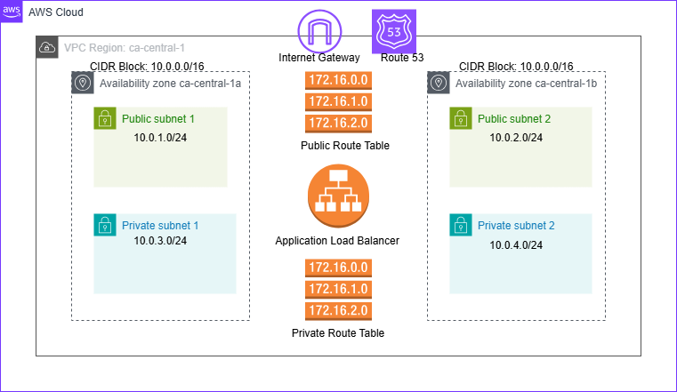

# **AWS Infrastructure Deployment with Terraform**



## Overview
Infrastructure as Code (IaC) for AWS using Terraform modules and GitHub Actions CI/CD pipelines.

## Prerequisites
- AWS Account & CLI
- AWS OIDC IAM Role
- Terraform >= 1.0.0
- GitHub Account
- Domain registered in Porkbun

## Structure
```
.
├── modules/
│   ├── networking/     # VPC, Subnets, Route Tables
│   ├── security/      # Security Groups
│   ├── loadbalancer/  # ALB Configuration
│   ├── acm/          # SSL Certificate
│   └── dns/          # Route53 Setup
│   └── dns_records/  # Route53 Records
│   └── ec2/          # EC2 Instance
├── environments/
│   └── prod/         # Production Environment
├── scripts/
│   └── update_nameservers.py  # Python script to update DNS records
│   └── aws-inventory.py  # Python script to generate AWS inventory
└── .github/
    └── workflows/    # CI/CD Github Actions Workflows
        └── terraform.yml
        └── terraform-ci.yml
        └── terraform-deploy.yml
        └── terraform-destroy.yml
        └── aws-inventory.yml
```

## GitHub Actions Workflows

### terraform-ci.yml
- Runs on PR
- Terraform fmt, init, validate
- Posts validation results to PR

### terraform-deploy.yml
- Runs on merge to main
- Deploys infrastructure
- Requires AWS OIDC role

### terraform-destroy.yml
- Manual trigger only
- Destroys infrastructure
- Requires approval

### aws-inventory.yml
- Manual/scheduled trigger
- Lists all AWS resources
- Generates CSV report

## Results

### Infrastructure Output


### Access Points
- HTTPS: https://myapp-prod.devopslab.buzz
- ALB: Application Load Balancer
- EC2: Private Instance in VPC