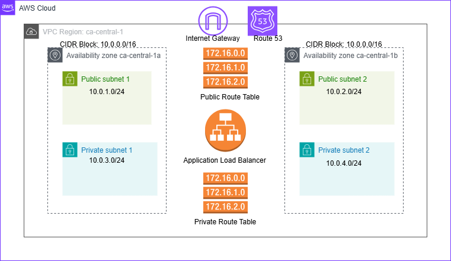

# **AWS Infrastructure Deployment with Terraform**



## **Introduction**

Creating a modular Infrastructure as Code (IaC) with Terraform is a great way to manage AWS resources efficiently and securely. This guide provides step-by-step instructions on how to create a VPC with public and private subnets, load balancer, and other AWS resources using Terraform modules with GitHub Actions CI/CD pipelines. We will use "prod" as an example name for the infrastructure throughout this guide.

## **Project Structure**
```
.
├── modules/
│   ├── networking/     # VPC, Subnets, Route Tables
│   ├── security/      # Security Groups
│   ├── loadbalancer/  # Application Load Balancer
│   └── dns/           # Route53 Configuration
├── environments/
│   └── prod/          # Production Environment
└── .github/
    └── workflows/     # CI/CD Configurations
```

## **Prerequisites**

1. AWS Account Setup:
   - AWS CLI configured
   - IAM permissions
   - Access and Secret keys

2. Required Tools:
   - Terraform >= 1.0.0
   - Git
   - GitHub Account

3. Repository Secrets:
   - IODC IAM role for GitHub Actions

## **Step-by-Step Guide**

### 1. CREATE A VPC

1. First, create the VPC module with the following settings:
   - VPC Name: "prod-vpc"
   - IPv4 CIDR block: 10.0.0.0/16
   - Enable DNS hostnames
   - Enable DNS support

2. Configure the VPC in terraform.tfvars:
```hcl
vpc_cidr = "10.0.0.0/16"
project_name = "prod"
```

3. The VPC module will automatically enable DNS hostnames and support.

### 2. CREATE SUBNETS

Next, you will need to create the public and private subnets. Configure the following settings:

Under "networking" module, create subnets with these settings:

**Public Subnet 1:**
- Subnet Name: "prod-public-subnet-1"
- Availability Zone: ca-central-1a
- IPv4 CIDR block: 10.0.1.0/24

**Public Subnet 2:**
- Subnet Name: "prod-public-subnet-2"
- Availability Zone: ca-central-1b
- IPv4 CIDR block: 10.0.2.0/24

**Private Subnet 1:**
- Subnet Name: "prod-private-subnet-1"
- Availability Zone: ca-central-1a
- IPv4 CIDR block: 10.0.3.0/24

**Private Subnet 2:**
- Subnet Name: "prod-private-subnet-2"
- Availability Zone: ca-central-1b
- IPv4 CIDR block: 10.0.4.0/24

### 3. CREATE INTERNET GATEWAY

1. Create an Internet Gateway:
   - Name: "prod-igw"
   - Attach to: prod-vpc

2. This enables internet access for resources in public subnets.

### 4. CREATE NAT GATEWAY

1. Create NAT Gateway in the first public subnet:
   - Name: "prod-nat"
   - Subnet: prod-public-subnet-1
   - Requires: Elastic IP allocation

2. This enables internet access for resources in private subnets.

### 5. CREATE ROUTE TABLES

1. Create Public Route Table:
   - Name: "prod-public-rt"
   - Route to Internet Gateway (0.0.0.0/0)
   - Associate with public subnets

2. Create Private Route Table:
   - Name: "prod-private-rt"
   - Route to NAT Gateway (0.0.0.0/0)
   - Associate with private subnets

### 6. CREATE SECURITY GROUPS

Create security groups with the following rules:

**ALB Security Group:**
- Name: "prod-alb-sg"
- Inbound Rules:
  - HTTP (80) from 0.0.0.0/0
  - HTTPS (443) from 0.0.0.0/0
  - ⏸️ HTTPS Listener (Port 443) - *Commented out, requires SSL certificate*
- Outbound Rules:
  - All traffic to 0.0.0.0/0

### 7. CREATE LOAD BALANCER

1. Create Application Load Balancer:
   - Name: "prod-alb"
   - Scheme: internet-facing
   - Subnets: Both public subnets
   - Security Group: prod-alb-sg

2. Create Target Group:
   - Name: "prod-tg"
   - Protocol: HTTP
   - Port: 80
   - VPC: prod-vpc

3. Create Listener:
   - Protocol: HTTP
   - Port: 80
   - Default Action: Forward to target group

### **DNS Configuration**
- ⏸️ Public Route53 hosted zone and CNAME entry for the ELB - *Commented out*

## **Note on DNS and HTTPS Implementation**

The following components are currently commented out in the code:

1. **Route53 and CNAME Configuration**
   - Requirements: "Public route53 hosted zone and CNAME entry for the ELB"
   - Status: Commented out
   - Reason: Requires a registered domain name
   - Files affected:
     - `modules/dns/main.tf`

2. **HTTPS Listener**
   - Status: Commented out
   - Reason: Requires SSL certificate
   - Files affected:
     - `modules/loadbalancer/main.tf`

### To Enable DNS and HTTPS

To implement these features, you will need:
1. A registered domain name
2. An SSL certificate from AWS Certificate Manager (ACM)

Once you have these prerequisites:
1. Uncomment the Route53 configuration in `modules/dns/main.tf`
2. Uncomment the HTTPS listener in `modules/loadbalancer/main.tf`
3. Update the domain name and certificate ARN in your terraform.tfvars file

## **GitHub Actions Workflows**

### 1. TERRAFORM CI/CD WORKFLOW (terraform.yml)

This is the main deployment pipeline:

1. Trigger Conditions:
   - Push to main branch
   - Pull requests
   - Manual workflow dispatch

2. Workflow Steps:
   - Checkout code
   - Setup Terraform
   - Configure AWS credentials
   - Initialize Terraform
   - Format check
   - Validate configuration
   - Plan changes
   - Apply changes (on main branch)

### 2. TERRAFORM CI WORKFLOW (terraform-ci.yml)

Handles continuous integration:

1. Trigger Conditions:
   - Pull requests
   - Push to main

2. Workflow Steps:
   - Code validation
   - Format checking
   - Plan generation
   - Plan output on pull requests

### 3. TERRAFORM DEPLOY WORKFLOW (terraform-deploy.yml)

Manual deployment workflow:

1. Trigger Conditions:
   - Manual workflow dispatch

2. Workflow Steps:
   - Environment selection
   - Plan generation
   - Apply changes
   - Deployment verification

### 4. TERRAFORM DESTROY WORKFLOW (terraform-destroy.yml)

Infrastructure cleanup workflow:

1. Trigger Conditions:
   - Manual workflow dispatch
   - Environment approval required

2. Workflow Steps:
   - Environment validation
   - Plan destruction
   - Confirmation step
   - Resource cleanup

### 5. AWS INVENTORY WORKFLOW (aws-inventory.yml)

Resource tracking workflow:

1. Trigger Conditions:
   - Manual workflow dispatch

2. Workflow Steps:
   - Scan AWS resources
   - Generate inventory tables
   - Create JSON report
   - Save as artifact

## Security Considerations

1. Network Security:
   - Private subnets for sensitive resources
   - Security group restrictions
   - NAT Gateway for private access

2. Access Control:
   - IAM least privilege
   - Environment approvals
   - State encryption

## Maintenance

1. Regular Tasks:
   - Infrastructure updates
   - Security patches
   - State backups

2. Monitoring:
   - Resource utilization
   - Cost tracking
   - Security compliance