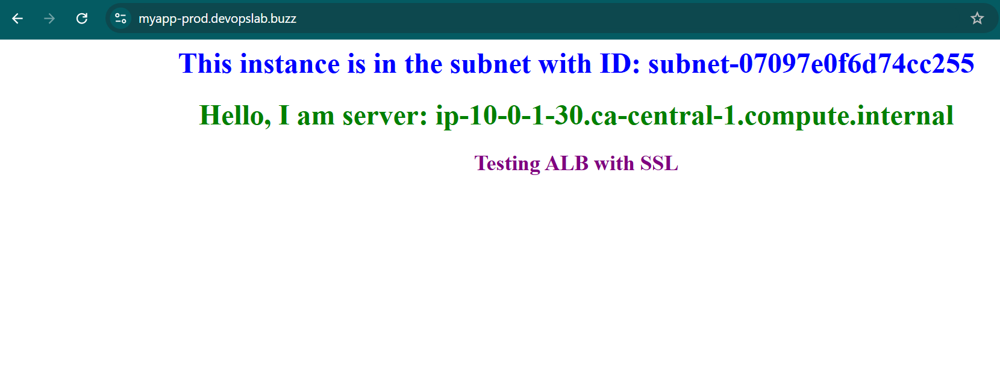

# **AWS Infrastructure Deployment with Terraform**


## Overview
Infrastructure as Code (IaC) for AWS using Terraform modules and GitHub Actions CI/CD pipelines.

## Prerequisites
- AWS Account & CLI
- AWS OIDC IAM Role
- Terraform >= 1.0.0
- GitHub Account
- Domain registered in Porkbun

## Structure
```
.
├── modules/
│   ├── networking/     # VPC, Subnets, Route Tables
│   ├── security/      # Security Groups
│   ├── loadbalancer/  # ALB Configuration
│   ├── acm/          # SSL Certificate
│   └── dns/          # Route53 Setup
│   └── ec2/          # EC2 Instance
├── environments/
│   └── prod/         # Production Environment
├── scripts/
│   └── update_nameservers.py  # Python script to update DNS records
│   └── aws_resource_inventory.py  # Python script to generate inventory using AWS API
│   └── service_config.py  # Python script to generate service configuration
└── .github/
    └── workflows/    # CI/CD Github Actions Workflows
        └── terraform.yml
        └── terraform-ci.yml
        └── terraform-deploy.yml
        └── terraform-destroy.yml
        └── aws-inventory.yml
```

## GitHub Actions Workflows

### terraform-ci.yml
- Runs on PR
- Terraform fmt, init, validate
- Posts validation results to PR

### terraform-deploy.yml
- Runs on merge to main
- Deploys infrastructure
- Requires AWS OIDC role

### terraform-destroy.yml
- Manual trigger only
- Destroys infrastructure
- Requires approval

### aws-inventory.yml
- Manual/scheduled trigger
- Lists all AWS resources
- Generates CSV report

## Results

### Infrastructure Output



## Usage Example

Customize `terraform.tfvars` for multiple environments:

```hcl
# Region and Environment
aws_region    = "ca-central-1"
project_name  = "prod"
environment   = "prod"

# Network Configuration
vpc_cidr = "10.0.0.0/16"
public_subnet_cidrs = [
  "10.0.1.0/24",
  "10.0.2.0/24"
]
private_subnet_cidrs = [
  "10.0.3.0/24",
  "10.0.4.0/24"
]

# Instance Configuration
ami_id = "ami-0ea18256de20ecdfc"  # Ubuntu 20.04 LTS in ca-central-1

# Domain Configuration
apex_domain = "devopslab.buzz"
domain_name = "myapp-prod.devopslab.buzz"

# DNS Provider Configuration
porkbun_api_key    = "pk1_d0c9d2b69a5f3ae22049aa93d5733399906db8d29572a9cae34bbd39f16d2bec"
porkbun_secret_key = "sk1_5ef1576233ff6ceeed330b0e8d055530950a5a2e83ea6bbc69a68c9ef0676142"
```

### Access Points
- HTTPS: https://myapp-prod.devopslab.buzz
- ALB: Application Load Balancer
- EC2: Private Instance in VPC

## How to Use This Repository

1. **Fork the Repository**
2. **Configure GitHub Actions**
   - Add required secrets in repository settings:
     - `AWS_ROLE_ARN`
     - `PORKBUN_API_KEY` to update domain nameservers
     - `PORKBUN_SECRET_KEY`

3. **Use GitHub Actions Workflows**
   - `terraform-deploy.yml`: Deploy infrastructure
   - `terraform-destroy.yml`: Destroy infrastructure
   - `aws-inventory.yml`: List AWS resources

For detailed workflow information, check the [GitHub Actions Workflows](#github-actions-workflows) section above.
  
## Demo Video
Watch the complete infrastructure deployment demonstration.

[](https://youtu.be/X_4e6vy0ndE)